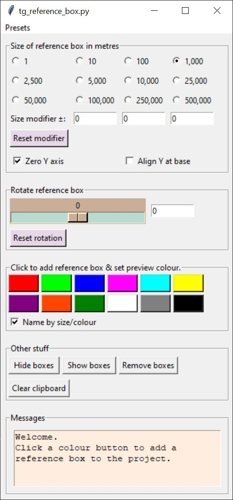

# tg-reference-box
&#9888; This Python script is now part of the <b>redmaw-tg-toolkit</b> repository, and will no longer be developed as a stand-alone script in this repository.

Click [here](https://github.com/RedMawVFX/redmaw-tg-toolkit) for the redmaw-tg-toolkit repository.  
Click [here](https://github.com/RedMawVFX/redmaw-tg-toolkit/tree/main/scripts/tg-reference-box) to go directly to the <i>tg-reference-box</i> folder in the redmaw-tg-toolkit.

Adds a user defined reference box to the current project.

This script utilizes Terragen's remote procedure call feature to add a Bounding box class object to the project.

Includes a UI to set the scale and rotation of the reference box.  Position of the reference box is based on project origin or valid coordinates in the clipboard.

The menubar includes a list of presets.

### Requirements  
Terragen 4 Professional v4.6.31 (or later)  
https://planetside.co.uk/

### Installation 
Install Terragen 4 Professional v4.6.31 or greater on your computer.  Terragen should be running when you run this script.

In this repository you’ll find two Python scripts, which are identical except for their file extensions.  The file ending in .PY will open a command window when run, while the file ending in .PYW will not.  I recommend using the file with the .PYW extension when the script is run or called from an external file or controller device like a Tourbox.

### Usage
When run, the UI presents controls for determining placement, size, and rotation of a reference box in the active Terragen project.  Additional controls for adding, selecting colour, and modifying boxes are provided.
<ul>
<li>
The location of the reference box is determined by either the origin of the project, i.e. <0,0,0> or valid coordinates in the clipboard.  Valid coordinates are obtained from Terragen by right clicking in the 3D Preview and selecting “Copy Coordinates” from the context menu. </li>
<li>
The size of the reference box is governed by the value of the radio buttons plus or minus any “<b>Size modifier</b>” values.  The “<b>Reset modifier</b>” button resets the “Size modifier” values to zero.  Checking the “<b>Zero Y axis</b>” button will constrain the height of the reference box at zero, while checking the “<b>Align Y at base</b>” button offsets the positive Y axis position by half its value, effectively positioning the reference box on the ground. (There’s no guarantee that terrain exists below the reference box). </li>
<li>
Additionally, a set of semi-useful but fun values exist under the <b>Presets</b> menu.  When an item from the drop down list is selected the radio buttons and Size modifier values are automatically set. </li>
<li>
You can rotate the reference box with the Slider or Entry widgets as desired.  The “<b>Reset rotation</b>” button conveniently resets the rotation value to zero. </li>
<li>
Clicking on any coloured button adds a reference box to the project.  The “<b>Preview colour</b>” of the box object is set to the colour of the button chosen…so choose carefully.  When the “<b>Name by size/colour</b>” button is checked the Bounding box node is named accordingly, for example “<b>refBox green ~100x0x100</b>” indicating a green reference box approximately 100 metres by 0 metres by 100 metres. When left unchecked the node’s name is determined by Terragen. </li>
<li>
Clicking “<b>Hide boxes</b>” will disable all Bounding box objects in the project.  Clicking “<b>Show boxes</b>” will enable all Bounding boxes in the project.  Clicking “<b>Remove boxes</b>” permanently removes all boxes from the project. </li>
<li>
Clicking “<b>Clear clipboard</b>” clears the content of the clipboard, which effectively means reference boxes will be added at the origin. </li>
<li>
A message frame is provided to display information. </li>
</ul>

### Reference
terragen-rpc  
https://github.com/planetside-software/terragen-rpc  

Online documentation for Terragen RPC  
https://planetside.co.uk/docs/terragen-rpc/  

Blog posts on using Terragen RPC  
https://planetside.co.uk/blog/hello-rpc-part-1-scripting-for-terragen/  
https://planetside.co.uk/blog/hello-rpc-part-2-error-handling/  
https://planetside.co.uk/blog/script-it-yourself-kelvin-sunlight-colour-with-terragen-rpc/  
